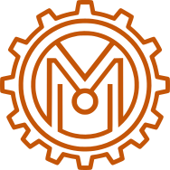

<p align="center">
  
</p>

<h1 align="center">Material RS</h1>

<p align="center">
  Material Design 3 Expressive component library for Rust and Yew
</p>

<p align="center">
  <a href="https://material-rs.nikan.dev">Documentation</a> ·
  <a href="https://github.com/nikandlv/material-rs">GitHub</a> ·
  <a href="https://crates.io/crates/material-rs">Crates.io</a>
</p>

---

Material RS is a full implementation of [Material Design 3 Expressive](https://m3.material.io/) for the [Yew](https://yew.rs/) framework, written entirely in Rust. It compiles to WebAssembly with zero JavaScript dependencies.

## Features

- **40+ Components** — Buttons, cards, dialogs, tables, navigation, and every building block for production apps
- **Dynamic Color** — Full MD3 color system with 5 palettes generated from a seed color via HCT color science
- **Light & Dark Mode** — Complete theme support with smooth transitions
- **RTL Support** — Built-in right-to-left layout via CSS logical properties
- **Syntax Highlighting** — Code view component with highlighting for Rust, JS, CSS, HTML, and more
- **Pure Rust / WASM** — Zero JavaScript. Full type safety and native performance
- **Fully Themeable** — Custom typography, shape tokens, elevation scales, and per-component style overrides

## Quick Start

Add to your `Cargo.toml`:

```toml
[dependencies]
material-rs = "0.1"
```

Wrap your app with the theme provider:

```rust
use material_rs::components::*;
use material_rs::theme::{MaterialThemeProvider, ThemeBuilder, ThemeMode};

#[function_component]
fn App() -> Html {
    let theme = ThemeBuilder::new()
        .seed("#6750A4")  // any hex color
        .mode(ThemeMode::Light)
        .build();

    html! {
        <MaterialThemeProvider theme={theme}>
            <Button label="Hello Material 3!" />
        </MaterialThemeProvider>
    }
}
```

## Dynamic Theming

Generate a complete color scheme from any seed color:

```rust
let theme = ThemeBuilder::new()
    .seed("#0061A4")  // blue seed
    .mode(ThemeMode::Dark)
    .build();
```

All 28+ color tokens (primary, secondary, tertiary, surface variants, outline, inverse, etc.) are derived automatically using the official Material Color Utilities HCT algorithm.

## Components

| Category | Components |
|----------|-----------|
| **Form Controls** | Button, FAB, Split Button, TextField, TextArea, Select, Checkbox, Radio, Switch, Slider, Toggle Button Group, Chip |
| **Data Display** | Card, Badge, List, Table, Avatar, Icon, Image List, Accordion, Code View, Carousel |
| **Feedback** | Dialog, Snackbar, Tooltip, Progress (Linear/Circular/Wavy), Skeleton, Alert Box, Bottom Sheet |
| **Navigation** | Top App Bar, Navigation Drawer, Navigation Rail, Navigation Bar, Tab Bar, Breadcrumb, Tabs |
| **Layout** | Box, Grid, Typography, Divider, Container, Spacer, Ripple, Shapes |

## Theming

Every component supports per-component CSS overrides:

```rust
let theme = ThemeBuilder::new()
    .seed("#6750A4")
    .component("Button.root", "border-radius: 24px;")
    .component("Card.root", "box-shadow: 0 4px 12px rgba(0,0,0,0.1);")
    .build();
```

## Showcases

The documentation includes full-page demos:

- **Login Page** — Authentication flow with form validation
- **Admin Dashboard** — Persistent drawer, stat cards, data tables
- **Email App** — Folder sidebar, message list, star toggles
- **Blog** — Featured posts, article grid, categories
- **Settings** — Sidebar navigation, profile form, toggles
- **E-commerce** — Product grid, filter chips, ratings

## Development

```bash
# Run the documentation app
cd apps/documentation
trunk serve

# Build the core library
cargo build -p material-rs
```

## License

MIT
